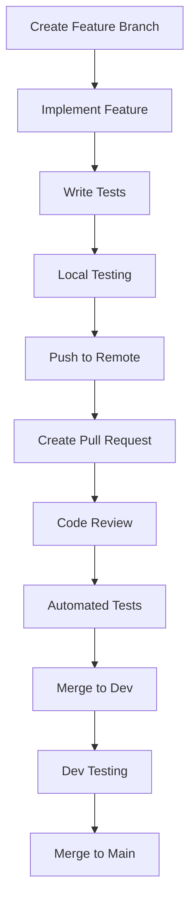

# Hostelpulse - Branch Management Strategy

## Übersicht

Diese Branch-Management-Strategie für Hostelpulse kombiniert Trunk-based Development mit strukturierten Feature Branches, um eine Balance zwischen Entwicklungsgeschwindigkeit, Codequalität und Teamzusammenarbeit zu erreichen.

## Grundprinzipien

### 1. **Trunk-based Development als Basis**
- **Main Branch** als zentrale Entwicklungsachse
- Häufige, kleine Commits in main
- Automatisierte Qualitätssicherung vor jedem Merge

### 2. **Feature Branches für komplexe Änderungen**
- Kurze Lebensdauer (max. 2-3 Tage)
- Klare Benennungskonventionen
- Regelmäßige Synchronisation mit main

### 3. **Qualität vor Geschwindigkeit**
- Automatisierte Tests und Code-Reviews
- Build-Validierung vor Merge
- Memory Bank Updates für signifikante Änderungen

## Branch-Struktur

```
main (production-ready)
├── dev (integration branch)
│   ├── feature/booking-system
│   ├── feature/user-dashboard
│   ├── feature/payment-integration
│   ├── bugfix/login-validation
│   └── hotfix/critical-security-patch
└── release/v1.0.0 (für Releases)
```

## Branch-Arten und deren Verwendung

### 1. **Main Branch**
**Zweck**: Production-ready Code
**Regeln**:
- Nur gemergt aus `dev` nach erfolgreichen Tests
- Immer deployable
- Tägliche Backups
- Strict branch protection rules

### 2. **Dev Branch**
**Zweck**: Integrations-Branch für Features
**Regeln**:
- Tägliche Merges aus Feature Branches
- Vollständige Test-Suite muss passen
- Code Review erforderlich
- Automatisierte Build-Validierung

### 3. **Feature Branches**
**Zweck**: Entwicklung neuer Features
**Benennung**: `feature/[kurze-beschreibung]`
**Beispiele**:
- `feature/tax-collection`
- `feature/invoice-generation`
- `feature/multi-platform-sync`

### 4. **Bugfix Branches**
**Zweck**: Behebung von Bugs
**Benennung**: `bugfix/[kurze-beschreibung]`
**Beispiele**:
- `bugfix/login-validation`
- `bugfix/payment-processing`

### 5. **Hotfix Branches**
**Zweck**: Kritische Patches für Production
**Benennung**: `hotfix/[kurze-beschreibung]`
**Beispiele**:
- `hotfix/security-vulnerability`
- `hotfix/payment-gateway-down`

## Workflow-Prozesse

### Feature Development Workflow



### Schritte im Detail:

1. **Branch erstellen**:
   ```bash
   git checkout main
   git pull origin main
   git checkout -b feature/booking-system
   ```

2. **Regelmäßig synchronisieren**:
   ```bash
   git fetch origin
   git rebase origin/main
   ```

3. **Pull Request erstellen**:
   - Klare Beschreibung der Änderungen
   - Verlinkung zu relevanten Issues
   - Checkliste für Code Review

4. **Code Review Prozess**:
   - Mindestens 1 Reviewer
   - Fokus auf Codequalität und Architektur
   - Automatisierte Tests müssen passen

## Qualitätssicherung

### Automatisierte Checks
- **Pre-commit Hooks**: Linting und Unit Tests
- **CI/CD Pipeline**: Vollständige Test-Suite
- **Build Validation**: Production-Build Test
- **Security Scans**: Automatisierte Sicherheitsprüfungen

### Manuelle Reviews
- **Code Review**: Architektur und Codequalität
- **Testing Review**: Testabdeckung und Edge Cases
- **Documentation Review**: Memory Bank Updates

## Merge-Strategien

### 1. **Squash Merge** für Feature Branches
```bash
git merge --squash feature/booking-system
git commit -m "feat: implement booking system

- Add booking form component
- Implement payment processing
- Add booking confirmation
- Update user dashboard

Closes #123"
```

### 2. **Merge Commit** für wichtige Integrationen
```bash
git merge dev --no-ff -m "Merge dev into main: Release v1.1.0"
```

## Konfliktlösung

### Strategie bei Merge-Konflikten:
1. **Konflikte analysieren**: Verstehen, welche Änderungen kollidieren
2. **Mit Team kommunizieren**: Bei unsicheren Konflikten absprechen
3. **Konservative Lösung**: Lieber zu viel besprechen als falsch mergen
4. **Tests nach Merge**: Vollständige Test-Suite laufen lassen

### Beispiel für Konfliktlösung:
```bash
# Konflikte anzeigen
git status

# Datei mit Konflikten öffnen und lösen
# Dann committen
git add <resolved-file>
git commit -m "Resolve merge conflict in booking component"
```

## Monitoring und Metriken

### Zu trackende KPIs:
- **Branch-Lebensdauer**: Durchschnittliche Zeit bis Merge
- **Merge-Konflikte**: Anzahl pro Woche
- **Build-Erfolg**: Prozentsatz erfolgreicher Builds
- **Review-Zeit**: Durchschnittliche Zeit für Code Reviews

### Regelmäßige Reviews:
- **Wöchentliche Retrospektive**: Branch-Strategie optimieren
- **Monatliche Metrik-Analyse**: Trends identifizieren
- **Quartalsweise Strategie-Anpassung**: Framework verbessern

## Notfall-Prozeduren

### Bei kritischen Bugs in Production:
1. **Hotfix Branch erstellen** von main
2. **Schnelle Implementierung** der Fix
3. **Minimale Tests** für kritische Pfade
4. **Direkter Merge** zu main (ohne dev)
5. **Sofortiges Deployment**

### Beispiel:
```bash
git checkout main
git pull origin main
git checkout -b hotfix/payment-security
# Fix implementieren
git add .
git commit -m "fix: security vulnerability in payment processing"
git push origin hotfix/payment-security
# Nach Review: direkter Merge zu main
```

## Tool-Unterstützung

### Empfohlene Tools:
- **GitHub/GitLab**: Branch Protection, Pull Requests, CI/CD
- **Pre-commit Hooks**: husky für lokale Qualitätschecks
- **Git Flow Extensions**: Automatisierte Branch-Management
- **Monitoring Tools**: Branch-Metriken und Alerts

### Automatisierung:
```json
// .github/workflows/branch-protection.yml
{
  "branches": {
    "main": {
      "required_status_checks": ["tests", "lint", "build"],
      "required_pull_request_reviews": true,
      "restrictions": null
    }
  }
}
```

## Schulung und Onboarding

### Für neue Teammitglieder:
1. **Git-Grundlagen**: Branching, Merging, Rebasing
2. **Workflow-Schulung**: Praktische Übungen
3. **Code-Review-Guidelines**: Erwartungen und Best Practices
4. **Tool-Schulung**: Git-Tools und CI/CD

### Dokumentation:
- **Branch-Konventionen**: In Memory Bank dokumentiert
- **Workflow-Beispiele**: Konkrete Szenarien
- **Troubleshooting-Guide**: Häufige Probleme und Lösungen

## Fazit

Diese Branch-Management-Strategie bietet:
- **Schnelle Iterationen** durch Trunk-based Development
- **Qualitätssicherung** durch strukturierte Reviews
- **Skalierbarkeit** für wachsende Teams
- **Risikominimierung** durch klare Prozesse

Die Strategie sollte regelmäßig evaluiert und an die Bedürfnisse des Teams angepasst werden.